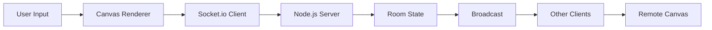

# CollabDraw System Architecture & Technical Specifications

This document outlines the software architecture, networking protocol, state synchronization model, and performance engineering behind **CollabDraw**.

---

## 1. System Architecture



### High-Level Components:
1. **Client-Side Canvas Renderer (`client/js/canvas.js`)**:
   - Captures native browser Pointer Events (`pointerdown`, `pointermove`, `pointerup`, `pointercancel`).
   - Scales the backing store with `window.devicePixelRatio` for retina clarity.
   - Immediately renders local strokes on the HTML5 2D canvas context (Client-Side Prediction).
   - Batches raw movement points and notifies the WebSocket client.
2. **Client-Side WebSocket Layer (`client/js/websocket.js`)**:
   - Maintains a duplex connection to the Node.js Socket.io server.
   - Emits batched points, cursor telemetry, and undo/redo requests.
   - Listens for remote stroke streams and room lifecycle events.
3. **Node.js Express & Socket.io Server (`server/server.js`, `server/websocket.js`)**:
   - The authoritative source of truth.
   - Validates all incoming payloads to protect against corrupted or malformed data.
   - Assigns monotonically increasing sequence numbers to completed operations.
   - Manages room presence and broadcasts mutations to room participants.
4. **Room Drawing State Engine (`server/drawing-state.js`)**:
   - Maintains an in-memory chronological array of completed operations (`operations`) and an undo stack (`undoneOperations`).
   - Executes global room-level undo and redo algorithms.

---

## 2. Drawing Data Flow

When a user draws on the canvas, the point data travels through the following pipeline:

```text
[ Pointer Event (x, y) ]
          │
          ├──> 1. Local Rendering (Immediate, 0ms latency)
          │       - ctx.beginPath(), ctx.moveTo(), ctx.lineTo(), ctx.stroke()
          │
          ├──> 2. Batching Queue
          │       - Appended to client's pointBatch array
          │       - Flushed when batch reaches 6 points OR every 25ms
          │
          └──> 3. Socket.io Event Emission
                  - emit("stroke-points", { strokeId, points })
                            │
                            ▼
              [ Node.js Authoritative Server ]
                            │
                            ├──> 4. Validation (Type checks, coordinate bounds)
                            │
                            └──> 5. Room Broadcast (socket.to(roomId))
                                      │
                                      ▼
                      [ Remote Collaborator Clients ]
                                      │
                                      ├──> 6. Incremental Rendering
                                      │       - Connects last known remote point to new points
                                      │       - No full canvas redraw required
                                      │
                                      └──> 7. Operation Commit
                                              - On "stroke-end", stroke is committed to state
```

---

## 3. WebSocket Protocol Specification

All communication occurs over Socket.io using structured JSON payloads.

| Event Name | Direction | Payload Schema | Description |
| :--- | :--- | :--- | :--- |
| `join-room` | Client → Server | `{ roomId: string, username: string, userId: string }` | Client requests to join or create a collaborative room. Server validates inputs, adds user to room, and invokes acknowledgment callback with initial room state. |
| `leave-room` | Client → Server | `{}` | Client signals leaving the active room. |
| `user-joined` | Server → Room | `{ user: { userId, username, userColor, cursor } }` | Broadcast to all room members when a new collaborator joins. |
| `user-left` | Server → Room | `{ userId: string, username: string }` | Broadcast to room members when a user leaves or disconnects. |
| `stroke-start` | Client → Server → Room | `{ roomId, strokeId, userId, x, y, color, width, tool }` | Initiates a new drawing stroke. Collaborators initialize in-flight stroke tracking and render the initial dot. |
| `stroke-points` | Client → Server → Room | `{ roomId, strokeId, points: [{ x, y }] }` | Streams an array of intermediate coordinates for an active stroke. Collaborators render incremental line segments. |
| `stroke-end` | Client → Server → Room | `{ roomId, strokeId, points? }` | Signals that a stroke has completed. Server assigns a sequence number and persists the stroke to room history. |
| `cursor-move` | Client → Server → Room | `{ roomId, x, y }` | Throttled pointer coordinates (max once per 35ms) to update remote user cursor positions. |
| `undo` | Client → Server | `{ roomId, userId }` | Requests to undo the most recent operation in the room. |
| `undo` | Server → Room | `{ operationId: string, undoneOp: Object }` | Broadcast when an operation has been undone. Clients remove the operation and reconstruct the canvas. |
| `redo` | Client → Server | `{ roomId, userId }` | Requests to redo the most recently undone operation. |
| `redo` | Server → Room | `{ operation: Object }` | Broadcast when an operation has been restored. Clients add the operation and reconstruct the canvas. |
| `clear-canvas` | Client → Server | `{ roomId, userId }` | Requests to clear the shared canvas. |
| `clear-canvas` | Server → Room | `{ operation: { id, type: 'clear', sequence } }` | Broadcast to wipe canvas across all clients. |
| `request-state`| Client → Server | `{ roomId }` | Requests full room state (used after reconnection). |
| `state-sync` | Server → Client | `{ operations: Array, sequence: number, users: Array, undoneCount: number }` | Authoritative state sync sent to joining or reconnecting clients. |
| `error` | Server → Client | `{ message: string }` | Notification of a validation failure or room error. |

---

## 4. Operation-Based State & Global Undo/Redo

Rather than broadcasting heavy bitmap screenshots after every draw event, CollabDraw represents drawings as discrete, structured **operations**:

```typescript
interface StrokeOperation {
  id: string;             // Unique operation ID (e.g., "stroke-1741234567")
  userId: string;         // Author user identifier
  type: 'stroke';         // Operation type
  tool: 'brush' | 'eraser';
  color: string;          // Hex color string (for brush)
  width: number;          // Stroke diameter in pixels (1 to 50)
  points: { x: number; y: number }[]; // Ordered coordinate points
  sequence: number;       // Monotonically increasing server sequence number
  timestamp: number;
}

interface ClearOperation {
  id: string;
  userId: string;
  type: 'clear';
  sequence: number;
  timestamp: number;
}
```

### Global Shared Undo/Redo Algorithm
Collaborative drawing requires a shared room history rather than isolated client-local undo queues:

1. **Shared Operation Stacks**:
   The server maintains two collections per room:
   - `operations = []` (Chronological array of active operations)
   - `undoneOperations = []` (LIFO stack of undone operations)
2. **Undo Flow**:
   - When any collaborator clicks **Undo**, the server pops the **latest active operation** from `operations` (regardless of who created it):
     $$\text{undoneOp} = \text{operations.pop()}$$
   - The operation is pushed onto `undoneOperations`.
   - The server broadcasts an `undo` event with `undoneOp.id`.
   - All connected clients remove the operation from their local array and trigger a full canvas reconstruction.
3. **Redo Flow**:
   - When any collaborator clicks **Redo**, the server pops the top operation from `undoneOperations`:
     $$\text{redoneOp} = \text{undoneOperations.pop()}$$
   - The server assigns a fresh sequence number:
     $$\text{redoneOp.sequence} = ++\text{sequence}$$
   - The operation is pushed back onto `operations`.
   - The server broadcasts `redo` with the restored operation.
4. **Reversible Clear**:
   - A `clear` action is pushed to `operations` as an operation `{ type: 'clear' }`.
   - When rebuilding the canvas, encountering a `clear` operation invokes `ctx.clearRect()`.
   - Because `clear` is a standard operation in the history, invoking **Undo** pops the clear operation and restores all previous strokes immediately!

---

## 5. Conflict Resolution & Concurrency

CollabDraw uses **server-authoritative sequence numbers** with an optimistic, lock-free approach:

- **No Canvas Locking**: Multiple users can draw across the same area of the canvas simultaneously. No user is ever blocked or forced to wait for another user's turn.
- **Deterministic Ordering**: Every completed stroke operation is assigned a strict sequence number by the server upon receipt (`101, 102, 103...`).
- **Overlapping Strokes**: If User A draws a red line and User B draws a blue line simultaneously at the exact same location:
  - Both strokes appear instantly on their respective local displays.
  - The server receives both operations and assigns sequential numbers ($S_A$ and $S_B$).
  - When replaying or synchronizing, operations are rendered in exact sequence order ($S_A \to S_B$). Both strokes are preserved completely, ensuring consistent visual state across all devices.

---

## 6. Performance Engineering Decisions

### 1. Client-Side Prediction (Zero Latency)
Local strokes are drawn immediately to the HTML5 Canvas context during the `pointerdown` and `pointermove` callbacks. The user perceives zero input lag, regardless of network conditions.

### 2. Point Batching
Emitting a WebSocket packet for every single micro-movement event at 120Hz/240Hz refresh rates causes severe network overhead and buffer bloat. CollabDraw batches points in a queue and transmits them either when:
- 6 points have accumulated, or
- 25 milliseconds have elapsed since the last transmission.
This balances bandwidth conservation with smooth, fluid rendering on remote screens.

### 3. Cursor Throttling
Remote cursor movements do not alter drawing data and are therefore throttled to at most one update every **35 milliseconds** (~28 updates/sec). Movement animations use hardware-accelerated CSS `transform: translate3d(x, y, 0)` for silky-smooth motion without CPU layout recalculations.

### 4. Incremental Remote Rendering
When receiving `stroke-points` for an active remote stroke, the client connects the new points to the previous point using `lineTo()` and `stroke()`. It does **not** wipe or redraw the entire canvas for streaming points. Full canvas reconstruction is reserved only for discrete state shifts: undo, redo, clear, resize, and initial room join.

### 5. High-DPI Sharpness
On high-resolution (Retina/HiDPI) screens, drawing on a 1:1 canvas results in blurry interpolation. CollabDraw samples `window.devicePixelRatio` and scales both the internal buffer width/height and the 2D transformation matrix:
```javascript
canvas.width = Math.floor(cssWidth * dpr);
canvas.height = Math.floor(cssHeight * dpr);
ctx.scale(dpr, dpr);
```
All logical stroke calculations remain in standard CSS pixels while rendering at native display resolution.

---

## 7. Resilience & Fault Tolerance

1. **Auto-Reconnection**:
   The Socket.io client is configured with infinite reconnection attempts and exponential backoff (`1s` to `5s`).
2. **State Recovery**:
   When the socket reconnects after a network interruption, it automatically emits `join-room` with the active `roomId` and `username`. The server responds with `state-sync`, and the client completely reconstructs the canvas from the latest authoritative operation history.
3. **Input Sanitization**:
   The server rigorously validates incoming data:
   - Stroke width is clamped between `1` and `50`.
   - Coordinates are verified to be finite numbers (`Number.isFinite`).
   - Coordinate points per stroke are capped at `5000` to prevent denial-of-service memory exhaustion.
   - Room IDs are validated against strict alphanumeric regular expressions.
